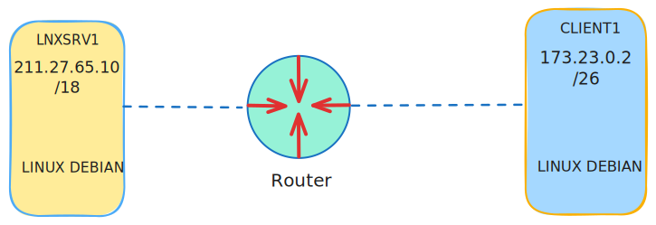

import CodeBlock from "@theme/CodeBlock"
import v from "./variables"

# Instalasi dan konfigurasi dasar

:::tip
Jika terminal linux sudah masuk mode **_superuser_** maka tidak perlu menjalankan perintah pada tutorial ini dengan tambahan `sudo` di depan pada setiap perintah.
:::

## Topologi

Topologi yang akan digunakan pada tutorial adalah sebagai berikut.

## Konfigurasi

### Instalasi paket aplikasi

Paket aplikasi yang dibutuhkan untuk menjalankan DNS adalah `bind9`. Berikut perintah yang perlu dijalankan pada <code>{v.SERVER_1_NAME}</code> untuk menginstal paket aplikasi tersebut.

<CodeBlock language="bash" title="CLI">
{`sudo apt install bind9 -y`}
</CodeBlock>

### Menambahkan _master zone_

Setelah menginstal paket aplikasi yang diperlukan, selanjutnya adalah melakukan konfigurasi `bind9` pada <code>{v.SERVER_1_NAME}</code>. Langkah pertama yaitu memodifikasi berkas `/etc/bind/named.conf.local` untuk menambahkan _zone_ yang diperlukan dengan baris kode berikut. Nama domain yang digunakan yang digunakan pada tutorial ini adalah <code>{v.FQDN}</code>.
:::info
Tulis baris kode berikut di baris terakhir pada berkas yang akan dimodifikasi <code>{v.BIND_NAMED_CONF_PATH}</code>.
:::

<CodeBlock language="text" title={v.BIND_NAMED_CONF_PATH} showLineNumbers>
{`zone "${v.FQDN}" {
    file "${v.BIND_F_ZONE_FILE_PATH}";
    type master;
};

zone "27.211.in-addr.arpa" {
    file "${v.BIND_R_ZONE_FILE_PATH}";
    type master;
};
`}
</CodeBlock>

### Menambahkan berkas _forward lookup zone_

Setelah itu langkah selanjutnya adalah membuat berkas _forward lookup_ untuk domain <code>{v.FQDN}</code> dengan menyalin berkas `/etc/bind/db.local` ke <code>{v.BIND_F_ZONE_FILE_PATH}</code>.

<CodeBlock language="bash" title="CLI">
{`sudo cp /etc/bind/db.local ${v.BIND_F_ZONE_FILE_PATH}`}
</CodeBlock>

Kemudian modifikasi berkas tersebut dengan baris kode berikut.

:::note
Pada file konfigurasi _zone_ `bind9` jika sebuah baris kode dimulai atau terdapat karakter titik koma `;`, maka baris kode tersebut akan dianggap komentar dan diabaikan dari konfigurasi `bind9`.
:::

:::info
Ada beberapa macam jenis record pada DNS yaitu:
- `SOA` atau _Start of Authority_ adalah jenis record yang memuat informasi penting tentang zona pada domain seperti nama domain server utama, alamat email administrator domain, kapan waktu terkhir zona domain.
- `A` digunakan untuk membuat record yang menerjemahkan nama domain ke alamat IP (ipv4).
- `AAAA` digunakan untuk membuat record yang menerjemahkan nama domain ke alamat IP (ipv6).
- `NS` digunakan untuk mengidentifikasi _nameserver_ yang bertanggung jawab pada zona DNS. Jenis record ini dapat memberi tahu mana server yang dapat dikontrak untuk mendapatkan record-record yang berkaitan dengan nama domain.
- `CNAME` record jenis dapat digunakan untuk membuat nama alias untuk nama domain yang lain.
- `MX` atau _Mail Exchanger_, record jenis ini digunakan untuk mengatur dan menentukan tingkat prioritas rute mana email akan dikirim ke sebuah nama domain tempat dimana Mail server dituju.
:::

<CodeBlock language="text" title={v.BIND_F_ZONE_FILE_PATH} showLineNumbers>
{`$TTL  604800
@ IN  SOA ${v.FQDN}. root.${v.FQDN}. (
            11  ; Serial
       604800   ; Refresh
        86400   ; Retry
      2419200   ; Expire
       604800 ) ; Negative Cache TTL
;
; informasi name server
@               IN  NS ${v.FQDN}.
ns1.${v.FQDN}. IN  NS ns1.${v.FQDN}.

; record A dan lainnya
@     IN  A  ${v.SERVER_1_HOST}
ns1   IN  A  ${v.SERVER_1_HOST}
www   IN  A  ${v.SERVER_1_HOST}
web   IN  CNAME www.${v.FQDN}.
mail  IN  A  ${v.SERVER_1_HOST}
@     IN  MX 10 mail.${v.FQDN}
`}
</CodeBlock>

### Menambahkan berkas _reverse lookup zone_

Pada contoh konfigurasi di atas ada beberapa tipe _record_ yang ditambahkan yaitu `A` untuk domain dengan _ipv4_, `NS` (**_Name Server_**) dan `MX` (**_Mail Exchanger_**). Langkah selanjutnya adalah membuat _Reverse lookup zone_ untuk domain <code>{v.FQDN}</code> dengan menyalin file `/etc/bind/db.127` ke <code>{v.BIND_R_ZONE_FILE_PATH}</code>.

<CodeBlock language="bash" title="CLI">
{`sudo cp /etc/bind/db.127 ${v.BIND_R_ZONE_FILE_PATH}`}
</CodeBlock>

Kemdian modifikasi berkas tersebut dengan baris kode berikut.

:::info
Kebalikan dari _Forward lookup_, _Reverse lookup_ adalah berkas yang memuat informasi tentang alamat IP apa saja yang akan diterjemahkan ke nama domain. 
:::

:::info
record `PTR` digunakan pada untuk membuat record _pointer_ yang berfungsi untuk menerjemahkan sebuah alamat IP ke nama domain.
:::

:::note
Ketika membuat _record PTR_ atau _pointer_ pada _reverse lookup_ gunakan angka pada _octet_ terakhir dari _IP host_ yang tersedia,
misal: IP `192.168.10.20` dengan CIDR `24` dan _netmask_ `255.255.255.0`, maka `20` adalah angka dari _octet_ terkahir IP _host_.
Untuk contoh kode konfigurasi pada tutorial ini, komputer <code>{v.SERVER_1_NAME}</code> memiliki alamat IP <code>{v.SERVER_1_HOST}</code>
dengan CIDR `18` dan _netmask_ `255.255.192.0`, maka `65.10` adalah angka dari _octet_ terakhir IP _host_.
:::

<CodeBlock language="text" title={v.BIND_R_ZONE_FILE_PATH} showLineNumbers>
{`$TTL  604800
@ IN  SOA ${v.FQDN}. root.${v.FQDN}. (
            10  ; Serial
       604800   ; Refresh
        86400   ; Retry
      2419200   ; Expire
       604800 ) ; Negative Cache TTL

; informasi name server
@     IN  NS  ns1.${v.FQDN}.

; record pointer
10.65 IN  PTR ${v.FQDN}.
10.65 IN  PTR ns1.${v.FQDN}.
10.65 IN  PTR mail.${v.FQDN}.
10.65 IN  PTR www.${v.FQDN}.
`}
</CodeBlock>

Setelah menulis berkas konfigurasi, langkah selanjutnya adalah memulai ulang layanan DNS pada komputer, dengan menjalankan perintah berikut.

<CodeBlock language="bash" title="CLI">
{`sudo systemctl restart bind9.service
# atau
sudo systemctl restart named.service`}
</CodeBlock>

### Pengujian

Setelah melakukan konfigurasi DNS pada komputer <code>{v.SERVER_1_NAME}</code>, langkah selanjutnya adalah melakukan pengujian pada komouter klien <code>{v.CLIENT_NAME}</code>.
Pertama-tama instal terlebih dahulu paket aplikasi `dnsutils` pada komputer klien {v.CLIENT_NAME} dengan menjalankan perintah berikut.

<CodeBlock language="bash" title="CLI">
{`sudo apt install dnsutils -y`}
</CodeBlock>

Jalankan perintah berikut pada komputer klien <code>{v.CLIENT_NAME}</code> untuk menguji layanan DNS dari komputer server <code>{v.SERVER_1_NAME}</code>.

<CodeBlock language="bash" title="CLI">
{`# contoh perintah
# nslookup -q=any <nama domain> <IP server DNS>

# perintah berikut adalah untuk menguji record yang terdapat pada berkas _forward lookup_ ${v.BIND_F_ZONE_FILE_PATH}
# highlight-next-line
nslookup -q=any ${v.FQDN} ${v.SERVER_1_HOST}

# contoh hasil dari perintah di atas
Server:        ${v.SERVER_1_HOST} 
Address:        ${v.SERVER_1_HOST}#53

${v.FQDN}      mail exchanger = 10 mail.${v.FQDN}.
${v.FQDN}
        origin = ${v.FQDN} 
        mail addr = root${v.FQDN}.
        serial = 2
        refresh = 604800
        retry = 86400
        expire = 2419200
        minimum = 604800
${v.FQDN}      nameserver = ns1.${v.FQDN}.
Name:  ${v.FQDN} 
Address:${v.SERVER_1_HOST} 
`}
</CodeBlock>

<CodeBlock language="bash" title="CLI">
{`# contoh perintah
# nslookup -q=any <alamat IP> <IP server DNS>

# perintah berikut adalah untuk menguji record yang terdapat pada Reverse zone
# highlight-next-line
nslookup -q=any ${v.SERVER_1_HOST} ${v.SERVER_1_HOST}

# contoh hasil dari perintah di atas
Server:         ${v.SERVER_1_HOST}
Address:        ${v.SERVER_1_HOST}#53

${v.SERVER_1_HOST_REVERSE}.in-addr.arpa       name = ${v.FQDN}.
${v.SERVER_1_HOST_REVERSE}.in-addr.arpa       name = ns1.${v.FQDN}.

`}
</CodeBlock>

Sekian tutorial instalasi dan konfigurasi dasar DNS pada Debian Linux. Materi selanjutnya mengkonfigurasi _DNS slave_.
