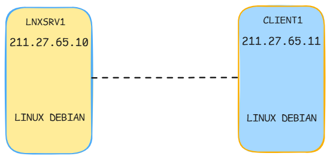

import CodeBlock from "@theme/CodeBlock"

export const SERVER_HOST = "211.27.65.10"
export const SERVER_HOST_REVERSE = SERVER_HOST.split(".").reverse().join(".")
export const CLIENT_HOST = "211.27.65.11"
export const SERVER_NAME = "LNXSRV1"
export const CLIENT_NAME = "client-1"
export const FQDN = "lkslab.net"
export const BIND_CONF_PREFIX_PATH = "/var/lib/bind"
export const BIND_F_ZONE_FILE_PATH = `${BIND_CONF_PREFIX_PATH}/db.${FQDN}`
export const BIND_R_ZONE_FILE_PATH = `${BIND_CONF_PREFIX_PATH}/db.27.211`

# Instalasi dan konfigurasi dasar

:::tip
Jika terminal linux sudah masuk mode **_superuser_** maka tidak perlu menjalankan perintah pada tutorial ini dengan tambahan `sudo` didepan pada setiap perintah.
:::

### Topologi

Topologi yang akan digunakan pada tutorial adalah sebagai berikut.

### Instalasi paket aplikasi

Paket aplikasi yang dibutuhkan untuk menjalankan DNS adalah `bind9`. Berikut perintah yang perlu dijalankan pada <code>{SERVER_NAME}</code> untuk menginstal paket aplikasi tersebut.

<CodeBlock language="bash" title="CLI">
{`sudo apt install bind9 -y`}
</CodeBlock>

### Konfigurasi dasar

Setelah menginstal paket aplikasi yang diperlukan, selanjutnya adalah melakukan konfigurasi `bind9` pada <code>{SERVER_NAME}</code>. Langkah pertama yaitu memodifikasi berkas `/etc/bind/named.conf.local` untuk menambahkan _zone_ yang diperlukan dengan baris kode berikut. Nama domain yang digunakan yang digunakan pada tutorial ini adalah <code>{FQDN}</code>.
:::info
Taruh kode berikut di baris terakhir pada berkas yang akan dimodifikasi.
:::

<CodeBlock language="text" title="/etc/bind/named.conf.local" showLineNumbers>
{`zone "${FQDN}" {
    file "${BIND_F_ZONE_FILE_PATH}";
    type master;
};

zone "27.211.in-addr.arpa" {
    file "${BIND_R_ZONE_FILE_PATH}";
    type master;
};
`}
</CodeBlock>

Setelah itu langkah selanjutnya adalah membuat _Forward zone_ untuk domain <code>{FQDN}</code> dengan menyalin berkas `/etc/bind/db.local` ke <code>{BIND_F_ZONE_FILE_PATH}</code>.

<CodeBlock language="bash" title="CLI">
{`sudo cp /etc/bind/db.local ${BIND_F_ZONE_FILE_PATH}`}
</CodeBlock>

:::info
Pada file konfigurasi _zone_ `bind9` jika sebuah baris kode dimulai atau terdapat karakter titik koma `;`, maka baris kode tersebut akan dianggap komentar dan diabaikan dari konfigurasi `bind9`.
:::

Kemudian modifikasi berkas tersebut dengan baris kode berikut.

<CodeBlock language="text" title={BIND_F_ZONE_FILE_PATH} showLineNumbers>
{`$TTL	604800
@	IN	SOA	${FQDN}. root.${FQDN}. (
			      2		; Serial
			 604800		; Refresh
			  86400		; Retry
			2419200		; Expire
			 604800 )	; Negative Cache TTL
;
; @ disini adalah nama domain yang sama dengan parent nya atau ${FQDN}
;
@    IN  NS ns1.${FQDN}.
@    IN  A ${SERVER_HOST} 
ns1  IN  A ${SERVER_HOST} 
www  IN  A ${SERVER_HOST} 
mail IN  A ${SERVER_HOST} 
@ IN  MX 10 mail.${FQDN}.
`}
</CodeBlock>

Pada contoh konfigurasi di atas ada beberapa tipe _record_ yang ditambahkan yaitu `A` untuk domain dengan _ipv4_, `NS` (**_Name Server_**) dan `MX` (**_Mail Exchanger_**). Langkah selanjutnya adalah membuat _Reverse zone_ untuk domain <code>{FQDN}</code> dengan menyalin file `/etc/bind/db.127` ke {BIND_R_ZONE_FILE_PATH}.

<CodeBlock language="bash" title="CLI">
{`sudo cp /etc/bind/db.127 ${BIND_R_ZONE_FILE_PATH}`}
</CodeBlock>

Kemdian modifikasi berkas tersebut dengan baris kode berikut.

:::info
Ketika membuat _record PTR_ atau _pointer_ pada _Reverse zone_ gunakan angka pada _octet_ terakhir dari _IP host_ yang tersedia, misal: IP `192.168.10.20` dengan CIDR `24` dan _netmask_ `255.255.255.0`, maka `20` adalah angka dari _octet_ terkahir IP _host_. Untuk contoh kode konfigurasi pada tutorial ini, komputer <code>{SERVER_NAME}</code> memiliki alamat IP <code>{SERVER_HOST}</code> dengan CIDR `18` dan _netmask_ `255.255.192.0`, maka `65.10` adalah angka dari _octet_ terakhir IP _host_.
:::

<CodeBlock language="text" title={BIND_R_ZONE_FILE_PATH} showLineNumbers>
{`$TTL	604800
@	IN	SOA	${FQDN}. root.${FQDN}. (
			      1		; Serial
			 604800		; Refresh
			  86400		; Retry
			2419200		; Expire
			 604800 )	; Negative Cache TTL
; 
@	IN	NS  ns1.${FQDN}.
10.65	IN  PTR	${FQDN}.
10.65	IN  PTR	ns1.${FQDN}.
`}
</CodeBlock>

Setelah menulis berkas konfigurasi, langkah selanjutnya adalah memulai ulang layanan DNS pada komputer, dengan menjalankan perintah berikut.

<CodeBlock language="bash" title="CLI">
{`sudo systemctl restart bind9.service
# atau
sudo systemctl restart named.service`}
</CodeBlock>

### Pengujian

Setelah melakukan konfigurasi DNS pada komputer <code>{SERVER_NAME}</code>, langkah selanjutnya adalah melakukan pengujian pada komouter klien <code>{CLIENT_NAME}</code>. Pertama-tama instal terlebih dahulu paket aplikasi `dnsutils` pada komputer klien {CLIENT_NAME} dengan menjalankan perintah berikut.

<CodeBlock language="bash" title="CLI">
{`sudo apt install dnsutils -y`}
</CodeBlock>

Jalankan perintah berikut pada komputer klien <code>{CLIENT_NAME}</code> untuk menguji layanan DNS dari komputer server <code>{SERVER_NAME}</code>.

<CodeBlock language="bash" title="CLI">
{`# contoh perintah
# nslookup -q=any <nama domain> <IP server DNS>

# perintah berikut adalah untuk menguji record yang terdapat pada Forward zone
# highlight-next-line
nslookup -q=any ${FQDN} ${SERVER_HOST}

# contoh hasil dari perintah di atas
Server:        ${SERVER_HOST} 
Address:        ${SERVER_HOST}#53

${FQDN}      mail exchanger = 10 mail.${FQDN}.
${FQDN}
        origin = ${FQDN} 
        mail addr = root${FQDN}.
        serial = 2
        refresh = 604800
        retry = 86400
        expire = 2419200
        minimum = 604800
${FQDN}      nameserver = ns1.${FQDN}.
Name:  ${FQDN} 
Address:${SERVER_HOST} 
`}
</CodeBlock>

<CodeBlock language="bash" title="CLI">
{`# contoh perintah
# nslookup -q=any <alamat IP> <IP server DNS>

# perintah berikut adalah untuk menguji record yang terdapat pada Reverse zone
# highlight-next-line
nslookup -q=any ${SERVER_HOST} ${SERVER_HOST}

# contoh hasil dari perintah di atas
Server:         ${SERVER_HOST}
Address:        ${SERVER_HOST}#53

${SERVER_HOST_REVERSE}.in-addr.arpa       name = ${FQDN}.
${SERVER_HOST_REVERSE}.in-addr.arpa       name = ns1.${FQDN}.

`}
</CodeBlock>

Sekian tutorial instalasi dan konfigurasi dasar DNS pada Debian Linux, Langkah selanjutnya adalah menambahkan lebih banyak _record_ dan mengkonfigurasi _DNS slave_ dan lain-lain.
