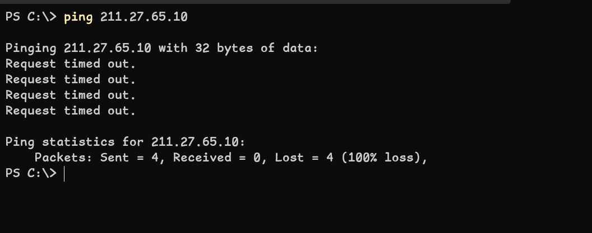
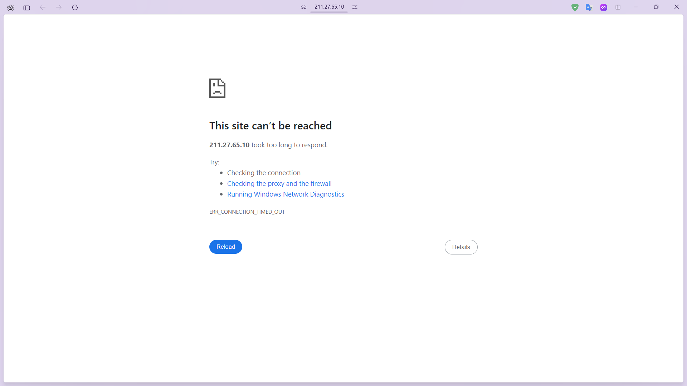
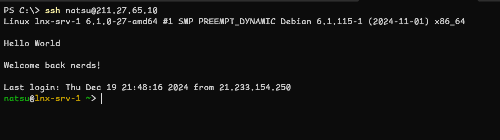
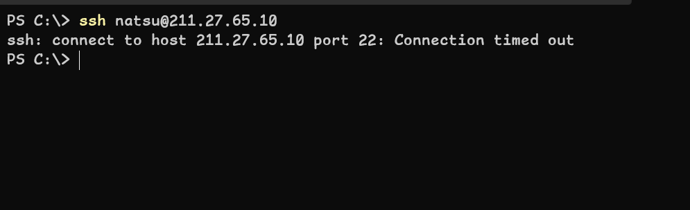
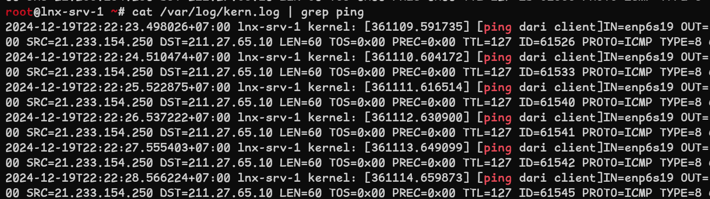

import Mermaid from "@theme/Mermaid"
import CodeBlock from "@theme/CodeBlock"
import v from "../variables"

# Instalasi dan konfigurasi dasar iptables firewall

:::info
**iptables** adalah perintah atau alat untuk membuat _rule_ atau aturan yang akan digunakan untuk menyaring lalu lintas jaringan masuk atau keluar sesuai dengan _rule_ yang di definisikan. Aturan pada **iptables** adalah sebuah aturan yang dibuat dengan menyertakan opsi dan parameter seperti jenis protokol, arah datangnya paket (**OUTPUT** atau **INPUT**), nomor port, alamat IP sumber berupa host/network, alamat IP tujuan berupa host/network dan jenis aksi yang akan dilakukan jika terdapat paket yang melewati lalu lintas jaringan sesuai dengan kondisi yang di definisikan pada iptables contoh nya seperti **DROP** untuk menolak paket, **ACCEPT** untuk mengizinkan paket, **REJECT** untuk menolak paket dan mengirimkan pesan error dan **LOG** untuk mencatat log paket yang melewati firewall.
:::

## Topologi

Berikut topologi yang akan digunakan pada tutorial ini.

<Mermaid value={`---
title: Topologi
---
%%{init:{'flowchart':{'rankSpacing': 100},'themeVariables': {'fontSize':'24px'}}}%%
flowchart LR 
  s1(" ${v.SERVER_1_NAME}  ${v.SERVER_1_ADDR+v.SERVER_CIDR+" ".repeat(4)+v.SERVER_1_OS}") <===>
  r1(("Router")):::nethw1 <===>
  c1(" ${v.CLIENT_1_NAME}  ${v.CLIENT_1_ADDR+v.CLIENT_CIDR+" ".repeat(4)+v.CLIENT_1_OS}")

  s1:::comp1    
  c1:::comp1

  classDef comp1 padding: 120px
  classDef nethw1 padding: 100px
`}/>

## Instalasi dan konfigurasi

### Instalasi paket aplikasi

Paket aplikasi yang perlu diintsal untuk konfigurasi iptables firewall adalah `iptables` dan `iptables-persistent`, instal paket aplikasi tersebut pada server <code>{v.SERVER_1_NAME}</code> dengan menjalankan perintah berikut.

<CodeBlock language="bash" title="CLI">
{`sudo apt install iptables -y`}
</CodeBlock>

### Konfigurasi

Pada tutorial ini akan dilakukan pengujian dengan beberapa _rules_ untuk memblokir dan mengizinkan paket dari dari lalu lintas jaringan, entah itu lalu lintas paket yang masuk atau keluar dari komputer server.

- **Rule 1**: Memblokir ping dari client ke server.
- **Rule 2**: Memblokir koneksi HTTP dari client ke server.
- **Rule 3**: Mengizinkan dan memblokir koneksi SSH dari client ke server.
- **Rule 4**: Log ping dari client ke server.

:::info
Ada beberapa opsi atau flags yang sering digunakan pada perintah iptables, berikut beberapa opsi yang sering digunakan:
- `-A` atau `--append` : Menambahkan rule baru pada chain yang sudah ada.
- `-D` atau `--delete` : Menghapus rule pada chain yang sudah ada.
- `-p` atau `--protocol` : Menentukan protokol yang akan di filter.
- `-s` atau `--source` : Menentukan alamat IP sumber.
- `-d` atau `--destination` : Menentukan alamat IP tujuan.
- `-j` atau `--jump` : Menentukan aksi yang akan dilakukan jika rule terpenuhi.
- `--dport` : Menentukan port tujuan.
- `--sport` : Menentukan port sumber.

Macam-macam chain pada iptables:
- **INPUT** : Chain ini digunakan untuk paket yang menuju ke server.
- **OUTPUT** : Chain ini digunakan untuk paket yang berasal dari server.
- **FORWARD** : Chain ini digunakan untuk paket yang melewati server.

Macam-macam jenis aksi pada iptables:
- **ACCEPT** : Mengizinkan paket melewati firewall.
- **DROP** : Menolak paket yang melewati firewall.
- **REJECT** : Menolak paket yang melewati firewall dan mengirimkan pesan error.
- **LOG** : Mencatat log paket yang melewati firewall.
- **RETURN** : Mengembalikan paket ke chain yang memanggilnya.
:::

#### Rule 1: Memblokir ping

Memblokir ping dari client ke server.

:::note
nilai CIDR 32 pada alamat IP client menunjukkan bahwa alamat IP tersebut adalah alamat IP host, bukan network.
:::

<CodeBlock language="bash" title="CLI">
{`sudo iptables -A INPUT -p icmp -s ${v.CLIENT_1_ADDR+v.HOST_CIDR} -j DROP`}
</CodeBlock>

Perintah di atas adalah untuk menambahkan rule dengan chain INPUT atau paket yang menuju ke server, dengan protokol ICMP atau ping, alamat IP sumber adalah alamat IP dari client, dan aksi yang dilakukan adalah DROP atau menolak paket.

#### Rule 2: Memblokir koneksi HTTP

:::note
Karena port bawaan dari HTTP adalah 80, maka _destination port_ nya adalah 80.
:::

Memblokir koneksi HTTP dari client ke server.

<CodeBlock language="bash" title="CLI">
{`# pada iptables saat menentukan port tujuan atau port sumber dapat menggunakan nama protokol atau nomor port
# contoh untuk port 80 adalah http dan nomor port 22 adalah ssh.

sudo iptables -A INPUT -p tcp --dport 80 -s ${v.CLIENT_1_ADDR+v.HOST_CIDR} -j DROP
# atau
sudo iptables -A INPUT -p tcp --dport http -s ${v.CLIENT_1_ADDR+v.HOST_CIDR} -j DROP
`}
</CodeBlock>

#### Rule 3: Mengizinkan dan memblokir koneksi SSH

Mengizinkan koneksi SSH dari client ke server.

<CodeBlock language="bash" title="CLI">
{`sudo iptables -A INPUT -p tcp --dport 22 -s ${v.CLIENT_1_ADDR+v.HOST_CIDR} -j ACCEPT`}
</CodeBlock>

Memblokir koneksi SSH dari client ke server.

:::note
Pada _rules_ iptables dapat menggunakan chain **INPUT** atau **OUTPUT** dengan hasil yang sama, namun perlu disesuaikan parameter nya.
:::

<CodeBlock language="bash" title="CLI">
{` # chain INPUT
sudo iptables -A INPUT -p tcp --dport 22 -s ${v.CLIENT_1_ADDR+v.HOST_CIDR} -j DROP

# atau bisa juga dengan menggunakan chain OUTPUT
sudo iptables -A OUTPUT -p tcp --sport 22 -d ${v.CLIENT_1_ADDR+v.HOST_CIDR} -j DROP
`}
</CodeBlock>

#### Rule 4: Log ping

Mencatat log ping dari client ke server.

<CodeBlock language="bash" title="CLI">
{`sudo iptables -A INPUT -p icmp -s ${v.CLIENT_1_ADDR+v.HOST_CIDR} -j LOG --log-prefix "ping dari client"`}
</CodeBlock>

:::note
`--log-prefix` digunakan untuk menambahkan pesan pada log yang dicatat.
:::

Untuk menampilkan log dari iptables, jalankan perintah berikut.

<CodeBlock language="bash" title="CLI">
{`cat /var/log/kern.log | grep "ping"`}
</CodeBlock>

:::note
jika berkas /var/log/kern.log tidak ditemukan, dapat menginstal paket aplikasi `rsyslog` dengan menjalankan perintah `sudo apt install rsyslog -y`.
:::

#### Menampilkan rule yang sudah dibuat

Untuk melihat _rules_ yang sudah dibuat pada iptables, jalankan perintah berikut.

<CodeBlock language="bash" title="CLI">
{`sudo iptables -L

# contoh output dari perintah di atas
Chain INPUT (policy ACCEPT)
target     prot opt source               destination
DROP       tcp  --  21.233.154.250       anywhere             tcp dpt:http
DROP       tcp  --  21.233.154.250       anywhere             tcp dpt:ssh

Chain FORWARD (policy ACCEPT)
target     prot opt source               destination

Chain OUTPUT (policy ACCEPT)
target     prot opt source               destination
DROP       icmp --  anywhere             21.233.154.250       icmp echo-reply
`}
</CodeBlock>

Sekian tutorial kali ini, materi selanjutnya akan membahas tentang cara menyimpan _rules_ iptables agar tidak hilang ketika server di restart dan penggunaan table nat pada iptables dengan menggunakan jenis _chain rule_ yang lain seperti **PREROUTING** dan **POSTROUTING**.
