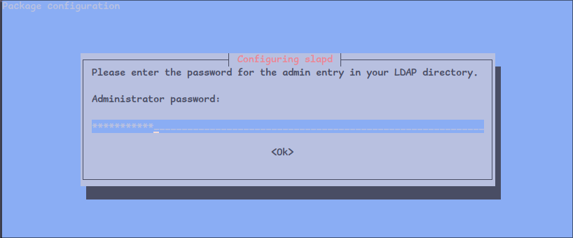
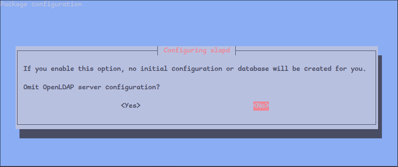
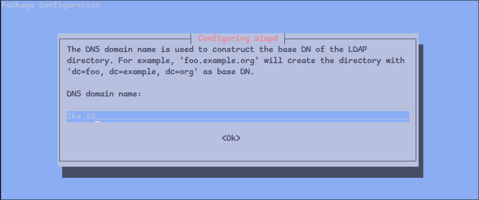
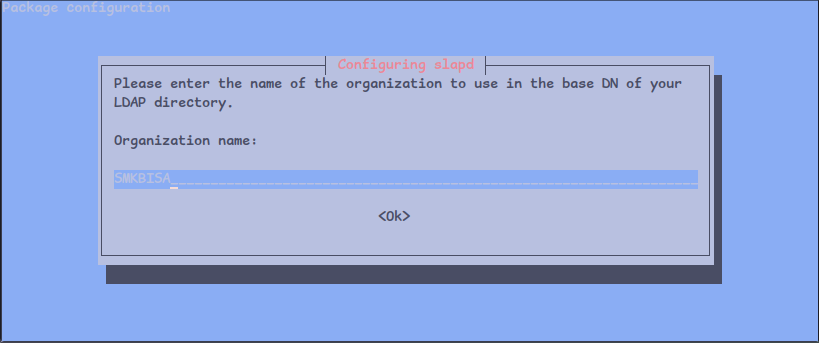
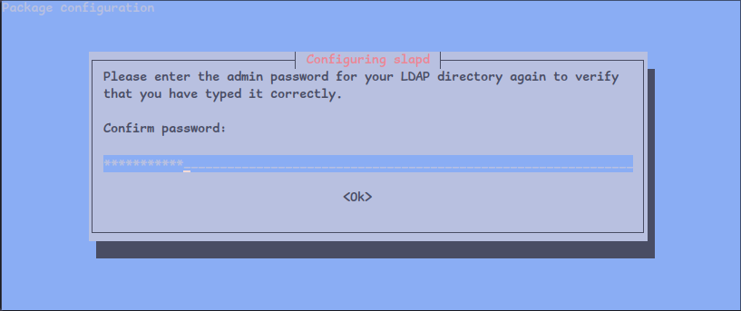
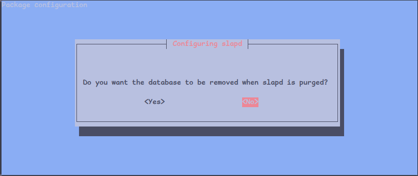
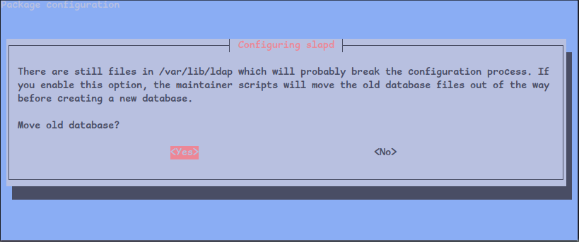

# Konfigurasi LDAP server pada Linux Debian

:::info
Menurut [Wikipedia](https://id.wikipedia.org/wiki/Lightweight_Directory_Access_Protocol) LDAP (Lightweight Directory Access Protocol) adalah protokol perangkat lunak untuk memungkinkan semua orang mencari resource organisasi, perorangan dan lainnya, seperti file atau printer di dalam jaringan baik di internet atau intranet.
:::

:::tip
Jika terminal linux sudah masuk mode **_superuser_** maka tidak perlu menjalankan perintah pada tutorial ini dengan tambahan `sudo` di depan pada setiap perintah.
:::

## Instalasi dan Konfigurasi

### Instalasi paket aplikasi

Beberapa paket aplikasi yang perlu diinstal yaitu `slapd` dan `ldap-utils`.

```bash title="CLI"
sudo apt install slapd ldap-utils -y
```

### Konfigurasi dasar

Setelah proses instalasi paket aplikasi yang dibutuhkan selesai maka akan muncul tampilan seperti gambar berikut untuk memasukan
kata sandi administrator.



Masukan kata sandi administrator dan konfirmasi ulang, setelah itu jalankan perintah berikut untuk mengatur nama domain dan nama organisasi dari LDAP server.

```bash title="CLI"
sudo dpkg-reconfigure slapd
```

Setelah menjalankan perintah diatas maka akan muncul tampilan seperti gambar berikut pada terminal, pilih **No** untuk melanjutkan.



Selanjutnya sesuaikan nama domain dan nama organisasi.




Kemudian buat kata sandi admin baru. Kata sandi ini akan digunakan ketika melakukan perubahan pada ldap server seperti membuat pengguna atau unit organisasi baru.




Pilih **No**.



Pilih **Yes**



## Konfigurasi Lanjutan

### Membuat Organization Unit

Setelah melakukan konfigurasi dasar langkah selanjutnya adalah menambahkan **_Organization Unit_** untuk mengelompokan berbagai macam objek seperti **_People_** dan **_Groups_** agar mudah dikelola dan dicari. Buat file dengan nama apapun misalnya `base-ou.ldif` kemudian edit dan isi file tersebut dengan baris kode berikut.

```yaml title="base-ou.ldif" showLineNumbers
dn: ou=people,dc=lks,dc=id
objectClass: organizationalUnit
ou: people

dn: ou=groups,dc=lks,dc=id
objectClass: organizationalUnit
ou: groups
```

Pada baris kode diatas di definisikan dua **_Organization Unit_** yaitu **_people_** dan **_groups_** dimana dua **_Organization Unit_** ini akan digunakan untuk mengelompokan objek-objek seperti informasi pengguna (_User_), perangkat komputer dan layanan autentikasi akun.

Setelah itu jalankan perintah berikut untuk menambah **_Organization Unit_** pada LDAP server sesuai yang di definisikan pada file `base-ou.ldif`.

```bash title="CLI"
sudo ldapadd -x -W -D "cn=admin,dc=lks,dc=id" -f base-ou.ldif

# Setelah menjalankan perintah diatas maka akan muncul pada terminal untuk memasukan kata sandi admin.
# highlight-next-line
Enter LDAP Password:
```

Untuk mengecek jika **_Organization Unit_** sudah di tambahkan atau terdaftar pada LDAP server bisa menggunakan perintah `ldapsearch`, berikut contoh perintahnya.

```bash title="CLI"
# contoh perintah
sudo ldapsearch -x -W -D "cn=admin,dc=lks,dc=id" "(ou=nama_organization_unit)"

# untuk mencari OU people hanya perlu mengubah filter atau nama organizational unit yang dicari.
sudo ldapsearch -x -W -D "cn=admin,dc=lks,dc=id" "(ou=people)"

# Masukan kata sandi administrator
# highlight-next-line
Enter LDAP Password:
```

Berikut contoh hasil _output_ atau keluaran dari perintah diatas.

```yaml showLineNumbers
# extended LDIF
#
# LDAPv3
# base <dc=lks,dc=id> (default) with scope subtree
# filter: (ou=people)
# requesting: ALL
#

# people, lks.id
dn: ou=people,dc=lks,dc=id
objectClass: organizationalUnit
ou: people

# search result
search: 2
result: 0 Success
# numResponses: 2
# numEntries: 1
```

Sekian tutorial instalasi dan konfigurasi LDAP server pada Linux Debian langkah selanjutnya adalah menambah lebih banyak objek-objek sesuai kebutuhan aplikasi yang sedang dibangun.

Berikut tautan tentang detail perintah `ldap`.

- [docs.oracle.com](https://docs.oracle.com/cd/A97630_01/network.920/a96579/comtools.htm)
- [server-world.info](https://www.server-world.info/en/note?os=Debian_12&p=openldap&f=1)
