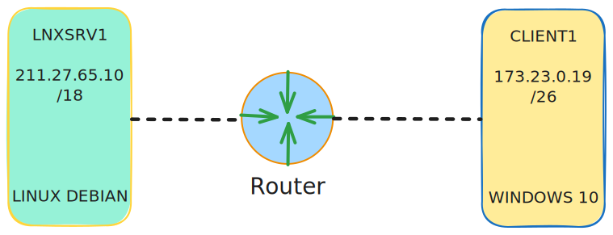

import CodeBlock from "@theme/CodeBlock"
import v from "../variables"

# Instalasi dan konfigurasi dasar

:::info
Nginx adalah software untuk menjalankan web server yang sangat populer dan efisien, dikenal karena kemampuannya menangani trafik yang tinggi dan dapat berfungsi juga sebagai _reverse proxy_, _load balancer_ dan _HTTP cache_.
:::

:::note
Bila terminal sudah masuk dalam mode _superuser_ maka tidak perlu menjalankan perintah dengan tambahan `sudo` pada setiap perintah.
:::

## Topologi

Berikut adalah topologi yang akan digunakan pada tutorial ini. 

## Instalasi dan konfigurasi dasar

### Instalasi paket aplikasi

Sebelum memulai konfigurasi, langkah pertama yang perlu dilakukan adalah menginstal paket aplikasi yang dibutuhkan yaitu `nginx` dengan menjalankan perintah berikut.

<CodeBlock language="bash" title="CLI">
{`sudo apt install nginx -y`}
</CodeBlock>

### Menambahkan berkas konfigurasi

Langkah selanjutnya adalah menambahkan berkas konfigurasi atau _vitual host_ untuk menentukan nomor port, konten yang akan disajikan, nama domain dan lain-lain. Pertama hapus dulu berkas konfigurasi bawaan dari `nginx` agar tidak menimpa konfigurasi yang akan ditambahkan.

<CodeBlock language="bash" title="CLI">
{`sudo rm ${v.NGINX_PREFIX_CONF_PATH}/site-enabled/default`}
</CodeBlock>

Langkah selanjutnya adalah menambahkan dan edit berkas konfigurasi dengan menjalankan perintah berikut.

:::info
<code>{v.NGINX_PREFIX_CONF_PATH}/conf.d</code> adalah direktori tempat berkas konfigurasi `nginx` disimpan dan dibuat.
:::

<CodeBlock language="bash" title="CLI">
{`# membuat berkas konfigurasi
sudo touch ${v.NGINX_VIRT_HOST_FILE_1}

# lalu edit dengan teks editor (nano, vim)
sudo nano ${v.NGINX_VIRT_HOST_FILE_1}
`}
</CodeBlock>

Isi berkas konfigurasi <code>{v.NGINX_VIRT_HOST_FILE_1}</code> dengan baris kode berikut.

:::note
baris kode yang dimulai dengan karakter `#` dianggap sebagai komen dan tidak termasuk dalam konfigurasi nginx.
:::

<CodeBlock language="bash" title={v.NGINX_VIRT_HOST_FILE_1} showLineNumbers>
{`server {
    # menentukan nomor port. 80 untuk protocol http, 443 untuk protocol https
    listen 80;

    # menentukan direktori dimana tempat berkas situs web disimpan
    root ${v.NGINX_WEB_ROOT_DIR};

    # menentukan berkas apa yang akan dicari dan dikirm sebagai konten yang akan disajikan pada root path '/'
    index index.html;

    # menentukan nama domain, jika web server belum memiliki nama domain, maka dapat diisi dengan karakater underscore '_'
    server_name _;
}
`}
</CodeBlock>

Selanjutnya tambahkan berkas html pada direktori root dari konfigurasi nginx yaitu pada <code>{v.NGINX_WEB_ROOT_DIR}</code> dengan nama berkas `index.html` sesuai dengan _index_ pada konfigurasi nginx. Buka berkas <code>{v.NGINX_HTML_FILE_PATH_1}</code> dengan teks editor seperti `nano` atau `vim`.

<CodeBlock language="bash" title="CLI">
{`sudo nano ${v.NGINX_HTML_FILE_PATH_1}`}
</CodeBlock>

Selanjutnya isi dengan dengan teks dengan syntax html yang akan ditampilkan pada halaman web, contohnya sebagai berikut.

<CodeBlock language="html" title={v.NGINX_HTML_FILE_PATH_1} showLineNumbers>
{`<html>
  <head>
    <title>Coba Web server nginx</title>
  </head>
  <body>
    <h1>Hello world</h1>
    <h2>Test web server</h2>
  </body>
</html>
`}
</CodeBlock>

Langkah selanjutnya adalah memulai ulang layanan nginx pada server <code>{v.SERVER_1_NAME}</code> dengan menjalankan perintah berikut.

<CodeBlock language="bash" title="CLI">
{`sudo systemctl restart nginx`}
</CodeBlock>

## Pengujian

### Membuka halaman web pada klien browser

Buka Web browser seperti `Google Chrome`, `Microsoft Edge`, `Firefox` atau sejenisnya pada komputer <code>{v.CLIENT_NAME}</code> dan masukan alamat IP atau nama domain dari komputer server <code>{v.SERVER_1_NAME}</code>. Berikut contoh tampilan halaman web pada Web browser dari komputer klien.

Sekian tutorial kali ini, materi selanjutnya adalah menggunakan SSL certificate untuk membuat koneksi aman dengan protokol HTTPS pada nginx.

