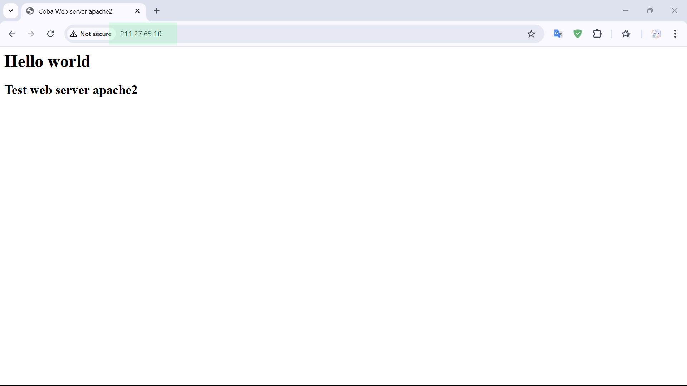

import CodeBlock from "@theme/CodeBlock"
import Mermaid from "@theme/Mermaid"
import v from "../variables"

# Instalasi dan konfigurasi dasar

:::info
**Server HTTP** Apache atau **Server Web/WWW Apache** adalah server web yang dapat dijalankan di banyak sistem operasi (Unix, BSD, Linux, Microsoft Windows dan Novell Netware serta platform lainnya) yang berguna untuk melayani dan memfungsikan situs web. Protokol yang digunakan untuk melayani fasilitas web/www ini menggunakan HTTP ([Wikipedia](https://id.wikipedia.org/wiki/Apache_HTTP_Server)).
:::

## Topologi

Topologi yang akan digunakan pada tutorial ini adalah sebagai berikut.

<Mermaid value={`---
title: Topologi
---
%%{init:{'flowchart':{'rankSpacing': 100},'themeVariables': {'fontSize':'24px'}}}%%
flowchart LR 
  s1(" ${v.SERVER_1_HOSTNAME}  ${v.SERVER_1_HOST+" ".repeat(4)+v.SERVER_1_OS}") <===>
  r1(("Router")):::nethw1 <===>
  c1(" ${v.CLIENT_1_HOSTNAME}  ${v.CLIENT_1_HOST+" ".repeat(4)+v.CLIENT_1_OS}")

  s1:::comp1    
  c1:::comp1

  classDef comp1 padding: 120px
  classDef nethw1 padding: 100px
`}></Mermaid>

## Instalasi paket aplikasi

Sebelum memulai konfigurasi, instal terlebih dahulu paket aplikasi `apache2` dengan menjalankan perintah berikut.

<CodeBlock language="bash" title="CLI">
{`apt install apache2`}
</CodeBlock>

## Konfigurasi

### Menambahkan virtual host

:::info
_Virtual host_ adalah metode untuk menghosting beberapa nama domain (dengan penanganan terpisah untuk setiap nama) pada satu server (atau kumpulan server). Hal ini memungkinkan satu server untuk berbagi sumber dayanya, seperti memori dan siklus prosesor, tanpa mengharuskan semua layanan yang disediakan untuk menggunakan nama host yang sama. Istilah hosting virtual biasanya digunakan untuk merujuk pada server web, tetapi prinsip-prinsipnya berlaku juga untuk layanan Internet lainnya.
:::

Matikan terlebih dahulu _virtual host_ bawaan dengan menjalankan perintah berikut.

<CodeBlock language="bash" title="CLI">{`a2dissite 000-default`}</CodeBlock>

Kemudian buat berkas _virtual host_ di <code>{v.APACHE_VIRT_HOST_FILE_1}</code> dan isi dengan baris kode berikut.

<CodeBlock language="apacheconf" title={v.APACHE_VIRT_HOST_FILE_1} showLineNumbers>
{`<VirtualHost *:80>
	  # ServerName www.example.com  
    DirectoryIndex index.html index.php
    DocumentRoot /var/www/html
</VirtualHost>
`}
</CodeBlock>

:::note
Pada berkas virtual host, baris kode yang dimulai dengan karakter <code>'#'</code> akan dianggap sebagai komen.
:::
:::info
Nomor port bawaan untuk protokol HTTP adalah 80, namun pada konfigurasi virtual host
dapat diubah dengan nomor port yang lain dan <code>'*'</code> disini berarti web server akan menerima
permintaan dari segala network atau alamat IP manapun yang tersedia pada komputer server <code>{v.SERVER_1_HOSTNAME}</code>.

- `ServerName` digunakan untuk menentukan nama domain pada konfigurasi virtual host.
- `DirectoryIndex` digunakan untuk menentukan nama berkas halaman web yang akan dicari pertama kali ketika klien mengakses Web server.
- `DocumentRoot` digunakan untuk menentukan direktori yaitu tempat dimana berkas-berkas halaman web disimpan, seperti berkas html atau php.
:::

### Mengaktifkan virtual host

Langkah selanjutnya adalah mengaktifkan berkas _virtual host_ yang sudah dibuat dengan menjalankan perintah berikut.

<CodeBlock language="bash" title="CLI">
{`a2ensite ${v.APACHE_VIRT_HOST_FILE_1.replace(/^.*[\\/]/, '')}`}
</CodeBlock>

### Memuat ulang layanan apache2

Setelah mengaktifkan _virtual host_, langkah selanjutnya adalah memuat ulang layanan apache2 dengan menjalankan perintah berikut.

<CodeBlock language="bash" title="CLI">
{`systemctl reload apache2`}
</CodeBlock>

### Menambahkan berkas halaman web

Selanjutnya tambahkan berkas html pada direktori root dari konfigurasi apache2 yaitu pada <code>{v.APACHE_WEB_ROOT_DIR}</code> dengan nama berkas `index.html` sesuai dengan `DirectoryIndex` pada konfigurasi _virtual host_. Kemudian buka berkas <code>{v.APACHE_HTML_FILE_PATH_1}</code> tersebut dengan teks editor seperti `nano` atau `vim`.

<CodeBlock language="bash" title="CLI">
{`nano ${v.APACHE_HTML_FILE_PATH_1}`}
</CodeBlock>

Selanjutnya modfikasi dan isi berkas html tersebut. Contohnya sebagai berikut.

<CodeBlock language="html" title={v.APACHE_HTML_FILE_PATH_1} showLineNumbers>
{`<html>
  <head>
    <title>Coba Web server apache2</title>
  </head>
  <body>
    <h1>Hello world</h1>
    <h2>Test web server apache2</h2>
  </body>
</html>
`}
</CodeBlock>

## Pengujian

Buka aplikasi _browser_ pada komputer klien <code>{v.CLIENT_1_HOSTNAME}</code> dan masukan nama domain atau alamat IP dari komputer server <code>{v.SERVER_1_HOSTNAME}</code>.

Sekian tutorial kali ini, materi atau tutorial selanjutnya adalah cara menkonfigurasi koneksi aman dengan SSL dan protokol HTTPS.